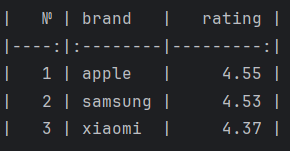

## csv_parser

csv_parser — это Python-скрипт для генерации отчетов из csv-файлов.

### Возможности

1. Поддержка нескольких csv-файлов
2. Формирование отчета average-rating: отчёт включает в себя список брендов и средний рейтинг бренда, бренды сортируются
   по рейтингу
3. Удобный вывод отчета в консоль с помощью tabulate
4. Возможность расширения: легко добавить новые типы отчетов (для демонстрации добавлен отчёт по средней цене брендов)
5. Скрипт покрыт тестами написанными на pytest

### Установите зависимости:

```bash
pip install -r requirements.txt
```

### Запуск скрипта:

```bash
python main.py --files products1.csv products2.csv --report average-rating
```

### Пример вывода:

